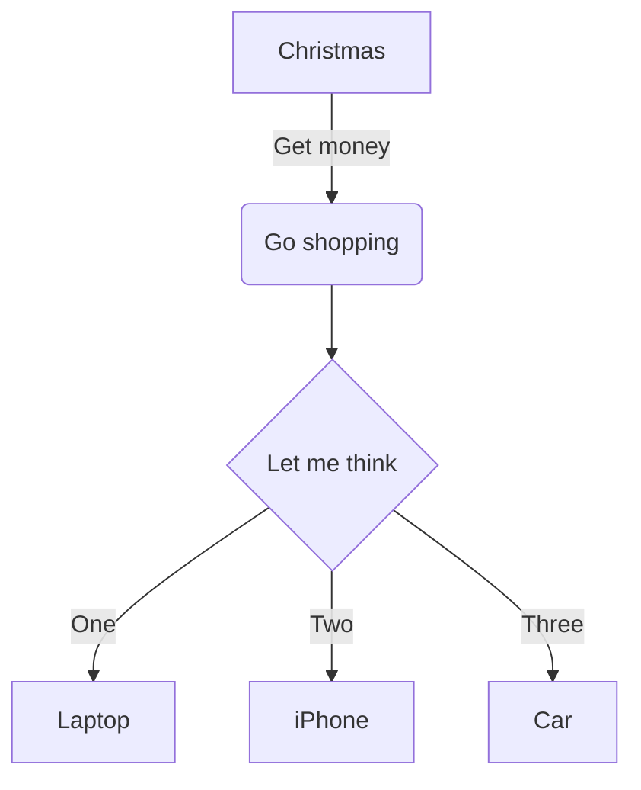

# Pro Markdown Manager

Adds project-friendly controls for Markdown-powered content so you can decide where Markdown is stored and rendered. The plugin vendors Automattic's WordPress.com Markdown parser (WPCom_GHF_Markdown_Parser), delivering Jetpack-equivalent Markdown (footnotes, fenced code, shortcodes, etc.) without requiring Jetpack itself.

## Features
- Toggle between GitHub-Flavoured Markdown (Jetpack's `WPCom_Markdown`) and Michel Fortin's Markdown Extra.
- GUI settings to opt individual post types into Markdown storage.
- Optional "Markdown Output" toggle لحقول ACF، مع إمكانية إبقاء post_content خامًا.
- Automatic sanitisation with `wp_kses_post()` on render.
- Plays nicely مع Jetpack عندما يكون مفعلاً (نستخدم نسخته من `WPCom_Markdown` تلقائياً).
- Built-in PrismJS syntax highlighting and Mermaid diagram support (version 10.9.4).

## Requirements
- WordPress 6.0+
- Advanced Custom Fields (optional, only for the field-level toggle).

## Installation
1. Copy the `pro-markdown-manager` directory into `wp-content/plugins/`.
2. Activate **Pro Markdown Manager** from **Plugins → Installed Plugins**.
3. (Optional) Zip the folder and upload via **Plugins → Add New → Upload Plugin** if distributing.

## Configuration
1. Navigate to **Settings → Markdown Manager**.
2. Tick the post types that should store Markdown (`post`, `page`, أو أي نوع مخصص تسجله).
3. Choose your preferred parser (**GitHub Flavoured Markdown** أو **Markdown Extra**).
4. (Optional) enable **Render post content** if you want the main editor (`post_content`) to be transformed; leave it unchecked to keep content stored وعرضه كماركداون خام.
5. Enable **ACF field option** إذا أردت ظهور مفتاح *Markdown Output* في حقول الـACF.

### Working with ACF
- Edit the field group, open any textarea or WYSIWYG field, and enable *Markdown Output*.
- The raw Markdown remains in postmeta; the plugin converts it to HTML during `acf/format_value`.
- Use `the_field()` / `get_field()` directly—avoid wrapping them in `esc_html()` or similar, otherwise Markdown HTML will be escaped.

### Custom Post Types
Every post type checked in the settings gains `pro-markdown` support. When تشغيل GFM فإن الإضافة تضيف أيضاً `wpcom-markdown` حتى يعمل تدفّق Jetpack الكامل؛ عند اختيار Markdown Extra نعتمد على المعالج المدمج فقط أثناء الإخراج (ولا يتم تحويل post_content إلا إذا كان خيار **Render post content** مفعلاً).

### Templates & Troubleshooting
- Template tags that escape content (`esc_html`, `strip_tags`, etc.) will neutralise Markdown output. Switch to `wp_kses_post()` or print directly.
- Block-based posts (`has_blocks() === true`) are left untouched; create dedicated Markdown templates if you need hybrid pages.
- If Jetpack is installed, its version of `WPCom_Markdown` will be reused automatically.

### Mermaid Diagram Support
To create Mermaid diagrams in your Markdown content, use fenced code blocks with the `mermaid` language identifier:

Supported diagram types include:
- Flowcharts (graph)
- Sequence diagrams
- Class diagrams
- State diagrams
- Entity Relationship diagrams
- User Journey diagrams
- Gantt charts
- Pie charts
- Requirement diagrams
- Gitgraph diagrams

For more information about Mermaid syntax, visit [mermaid.js.org](https://mermaid.js.org/).

## Development Notes
- Core Markdown sources live in `includes/wpcom/` and originate from Automattic's Jetpack plugin (GPL-compatible).
- `Jetpack_Options` is shimed فقط في وضع GFM كي نحاكي سلوك Jetpack.
- `includes/class-pro-markdown-parser.php` يتلقى وضع المحلل (`gfm` أو `markdown_extra`) ويتعامل مع fallback/التكامل مع Jetpack عند توفره.

## License & Credits
- Licensed under the GPLv2 (or later) in keeping with WordPress & Jetpack.
- `includes/wpcom/` directory contains code copied from [Automattic/Jetpack](https://github.com/Automattic/jetpack) and retains original headers.